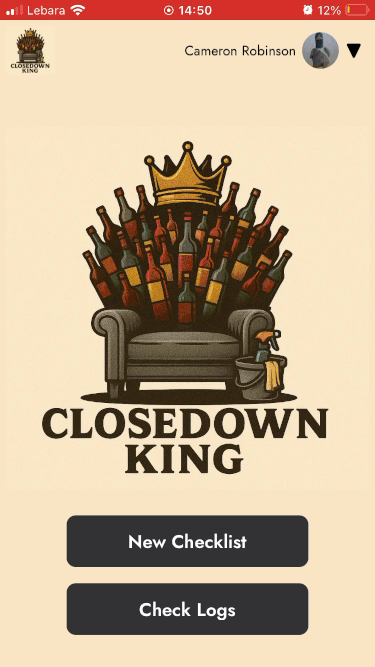

# Closedown King 🧹👑
## Description
This application was created with the intent to improve the end of night close downs at my job in a cocktail bar. 
Checklists are an excellent way of improving outcomes as it creates a source of truth for what needs to be done and requires people to rely on their memory less
which often isnt great when you are working until 2-3 am. We had created paper checklists to use before but either we never had any printed out so members of staff
would have to request them or they wouold get damaged. This application allows any member of staff to create a personal checklist from a set of templates so they 
can ensure they are doing their job properly and helps with new hires to know what to do.

## Demo

## Technologies Used
- PHP
- Laravel
- Blade
- Tailwind
  
Since this is a simple CRUD application I wanted a language/framework that would be easy and quick to develop with and lended itself to the needs of the application, I choose
PHP and Laravel as I was interested in learning it and new the MVC model was great for this kind of application. The socialite package was an added bonus as it was 
exactly what I needed for easy discord OAuth integration. I choose to develop with a mobile first approach as all users would be accessing this application from their mobile phones on
the bar so tailwind allowed for easy and rapid development with this in mind.

## Features
✅  Authentication through discord via socialite package to authorise access based on whether user is apart of our site discord server which is used for communications   
✅  Role based access control so only managers/team leaders can edit the templates that all users use to generate checklists  
✅  Time stamped log of checklists completed with user to create accountability  
✅  Mobile first user interface for easy access on mobile devices  
⏳  Collaborative checklists so multiple users can work on same one   
⏳  Push notifications to discord server when checlist is completed  

